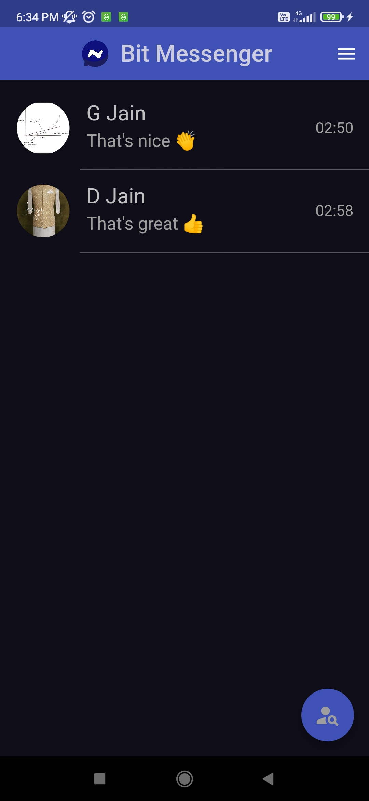
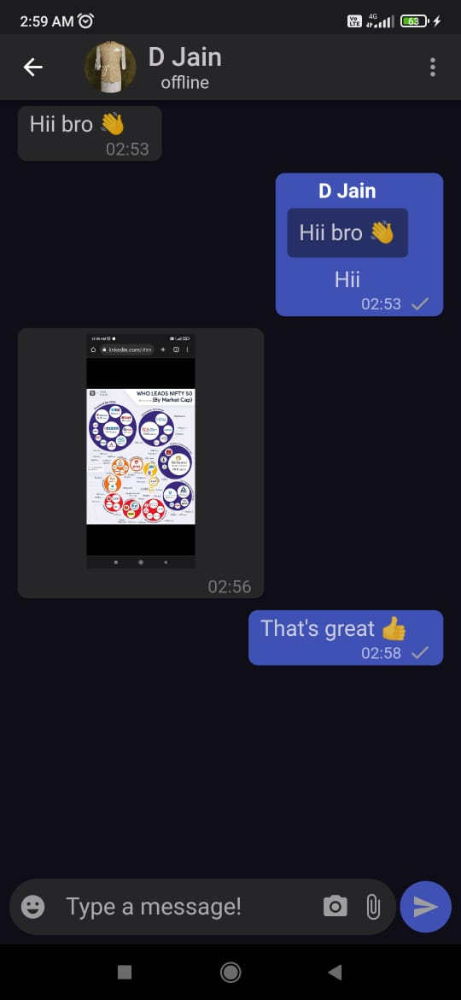
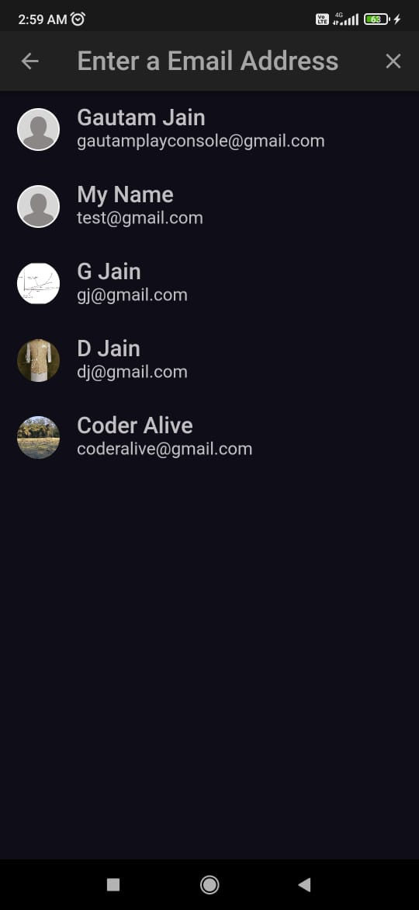
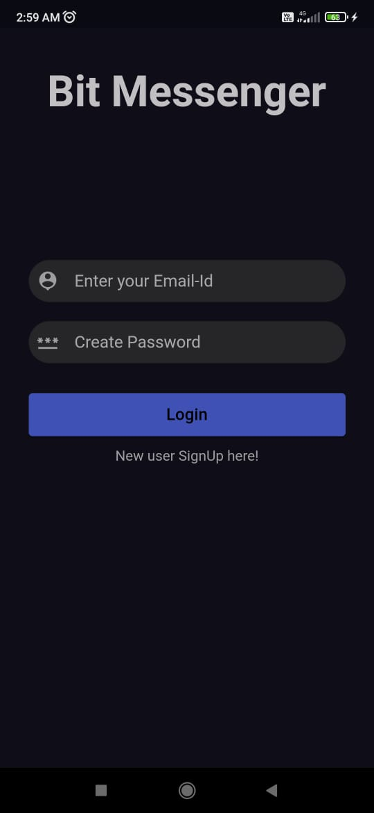

# Bit Messenger

Bit Messenger is  real-time chat application developed using Flutter that allows users to send and receive messages, images, videos, and other multimedia. It includes features such as user registration and authentication, a contact list, a chat interface for real-time messaging, emojis user profiles, message search, and encryption for security and privacy.

## logo


## App Images

|  |  |
| --- | --- |
|  |  |


## Features

- User Authentication
- Real-Time Chat
- Chat Features (text, photo, video, emojis)
- Online / Offline


## Tech Stacks

| Tools                 |                                     Link                                      |
|:----------------------|:-----------------------------------------------------------------------------:|
| 🤖  Language          |                       [Dart](https://dart.dev/)                               |
|  🩶   Framework         |                     [Flutter](https://flutter.dev/)                         |
| 🌐  Authentication    |                 [Firebase-Auth](https://firebase.google.com/docs/auth )        |
| 💻  Database          |           [Cloud-Firestore](https://firebase.google.com/docs/firestore)     |
| 📁  Storage          |           [Firebase-Storage](https://firebase.google.com/docs/storage)     |
| 🚀  State Management  |              [Riverpod](https://pub.dev/packages/flutter_riverpod)            |


## Installation

After cloning this repository, migrate to main branch.

- Create Firebase Project
- Enable Authentication
- Make Firestore Rules
- Create Android, iOS
- Use FlutterFire CLI to add the Firebase Project to this app. Then run the following commands to run your app:
 
```bash
  flutter pub get
  flutter run
```
    
## License


## Contributing

Contributions are always welcome!
